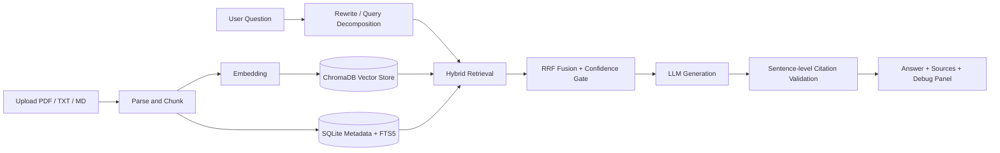

# AI Study Assistant


AI Study Assistant is a local-first RAG learning platform that turns PDFs, Markdown files, text notes, and study materials into a searchable, cited, quiz-ready personal knowledge base.

It is designed as more than a chat-with-docs demo: the project includes hybrid retrieval, multi-hop query planning, citation validation, answer quality gates, study workflows, a knowledge graph, and a polished React interface for daily learning.

## Highlights

- **Production-minded RAG pipeline**: ChromaDB vector retrieval, SQLite FTS5 keyword retrieval, Reciprocal Rank Fusion, confidence gating, and no-answer handling.
- **Multi-hop retrieval**: compound questions are decomposed into focused subqueries, retrieved independently, and fused with RRF to improve evidence coverage.
- **Citation safety**: generated answers are checked with sentence-level citation validation; uncited or out-of-range factual claims are replaced with a safe refusal.
- **Measurable quality gates**: isolated retrieval eval, hard-negative eval, multi-hop recall eval, and answer/citation quality eval are built into the repo.
- **Learning workflow**: upload documents, ask cited questions, generate quizzes, review mistakes, export Anki cards, and explore a concept graph.
- **Local-first storage**: documents, SQLite metadata, and ChromaDB indexes live on the user's machine.
- **Debuggability**: the Debug Panel exposes rewritten queries, retrieval subqueries, retrieved chunks, retrieval sources, token usage, and latency.

Current isolated hybrid retrieval baseline:

| Metric | Value |
|---|---:|
| MRR | 1.000 |
| Hit@1 | 1.000 |
| Hit@3 | 1.000 |
| No-answer accuracy | 1.000 |
| HardNeg@1 | 1.000 |

## Architecture



## Features

| Area | Capabilities |
|---|---|
| Document management | PDF/TXT/MD upload, note creation, tags, AI summaries, knowledge-base collections |
| RAG chat | cited answers, multi-turn query rewriting, multi-hop retrieval, source previews, chat history search |
| Retrieval quality | vector + FTS5 hybrid search, RRF ranking, hard-negative evaluation, confidence gating |
| Citation safety | explicit citation extraction, sentence-level citation completeness checks, safe refusal fallback |
| Quiz workflow | LLM-generated quizzes, online answering, mistake records, spaced review, Anki export |
| Dashboard | document stats, quiz stats, weak-point tracking, recent activity |
| Knowledge graph | concept extraction, relationship mining, D3 force-directed visualization |
| Multi-agent mode | supervisor routing to Tutor, Examiner, and Summarizer agents |
| Engineering tools | backup/restore, Markdown export, Debug Panel, offline evaluation scripts |

## Tech Stack

**Backend**

- FastAPI + Python 3.12
- SQLite with WAL mode
- ChromaDB vector store
- OpenAI-compatible LLM and embedding APIs
- PyMuPDF for PDF parsing and image extraction
- Ruff, mypy, pytest

**Frontend**

- React 18 + TypeScript
- Vite
- TailwindCSS
- D3.js
- Vitest

## Quick Start

### Requirements

- Python 3.12+
- Node.js 18+
- API key for one supported provider, or an OpenAI-compatible local provider such as Ollama

### 1. Start The Backend

```bash
cd backend

python3.12 -m venv venv
source venv/bin/activate

pip install -r requirements.txt

cp .env.example .env
# Edit .env and set OPENAI_API_KEY, GEMINI_API_KEY, DEEPSEEK_API_KEY,
# DASHSCOPE_API_KEY, MOONSHOT_API_KEY, MISTRAL_API_KEY, XAI_API_KEY,
# OPENROUTER_API_KEY, or configure a local Ollama provider.

python -m uvicorn app.main:app --host 127.0.0.1 --port 8000
```

API docs are available at:

```text
http://localhost:8000/docs
```

### 2. Start The Frontend

```bash
cd frontend

npm install
npm run dev
```

Open:

```text
http://localhost:5173
```

## Local Models

Local embeddings and reranking require the optional local dependencies:

```bash
cd backend
pip install -r requirements-local.txt
```

Example local embedding configuration:

```env
ASA_EMBEDDING_PROVIDER=local
ASA_EMBEDDING_MODEL=BAAI/bge-small-zh-v1.5
ASA_EMBEDDING_DIMENSION=512
```

Example Ollama configuration:

```bash
ollama pull qwen2.5:7b
```

```env
ASA_LLM_PROVIDER=ollama
ASA_LLM_MODEL=qwen2.5:7b
ASA_OLLAMA_BASE_URL=http://localhost:11434/v1
```

## Supported LLM Providers

The backend uses OpenAI-compatible chat completions wherever possible. You can switch providers from the Settings page or by editing `.env`.

| Provider | Example models | Key env |
|---|---|---|
| OpenAI | `gpt-5.5`, `gpt-5.4`, `gpt-4.1`, `gpt-4o-mini` | `OPENAI_API_KEY` |
| Google Gemini | `gemini-2.5-pro`, `gemini-2.5-flash` | `GEMINI_API_KEY` |
| DeepSeek | `deepseek-v4-flash`, `deepseek-chat`, `deepseek-reasoner` | `DEEPSEEK_API_KEY` |
| Alibaba Qwen / DashScope | `qwen-max`, `qwen-plus`, `qwen-turbo` | `DASHSCOPE_API_KEY` |
| Moonshot Kimi | `moonshot-v1-128k`, `moonshot-v1-32k` | `MOONSHOT_API_KEY` |
| Mistral AI | `mistral-large-latest`, `mistral-small-latest`, `codestral-latest` | `MISTRAL_API_KEY` |
| Zhipu / Z.ai GLM | `glm-4.5`, `glm-4.5-air`, `glm-4-plus` | `ZHIPU_API_KEY` |
| xAI Grok | `grok-4.3`, `grok-build-0.1`, `grok-4` | `XAI_API_KEY` |
| OpenRouter | Claude, Gemini, Grok, Llama, Mistral and more | `OPENROUTER_API_KEY` |
| Ollama | `qwen2.5:7b`, `llama3.1:8b`, `deepseek-r1:7b` | local |
| Custom OpenAI-compatible | any compatible model ID | `ASA_LLM_API_KEY` |

## Project Structure

```text
.
├── backend/
│   ├── app/
│   │   ├── main.py
│   │   ├── config.py
│   │   ├── db/
│   │   ├── evaluation/
│   │   │   ├── answer_quality.py
│   │   │   └── retrieval.py
│   │   ├── models/
│   │   ├── routers/
│   │   └── services/
│   │       ├── chunker.py
│   │       ├── citation_validator.py
│   │       ├── embedder.py
│   │       ├── generator.py
│   │       ├── query_planner.py
│   │       ├── rag.py
│   │       ├── retriever.py
│   │       ├── vectorstore.py
│   │       └── agents/
│   ├── eval/
│   ├── requirements.txt
│   └── requirements-dev.txt
├── frontend/
│   ├── src/
│   │   ├── api/
│   │   ├── components/
│   │   ├── pages/
│   │   └── test/
│   └── package.json
└── docs/
    ├── EVALUATION.md
    ├── PRD.md
    └── TECHNICAL_DESIGN.md
```

## Data Storage

All local application data is stored under:

```text
~/.ai-study-assistant/
├── data/
│   ├── documents/
│   ├── chroma_db/
│   ├── chunk_images/
│   └── app.db
```

## Evaluation

The repository includes deterministic offline evaluation scripts for retrieval and answer quality. These evaluations can run against an isolated versioned corpus so local user documents do not affect the score.

### Retrieval Quality Gate

```bash
cd backend

python -m app.evaluation.retrieval \
  --dataset eval/retrieval.golden.jsonl \
  --corpus eval/corpora/machine_learning_basics.jsonl \
  --modes vector hybrid \
  --k 1 3 5 \
  --output /tmp/retrieval-report.json \
  --summary-output eval/retrieval.baseline.summary.json \
  --gate-mode hybrid \
  --min-mrr 0.98 \
  --min-hit-at 1=0.97 \
  --min-hit-at 3=1.00 \
  --min-hard-negative-free-at 1=1.00 \
  --min-no-answer-accuracy 1.00 \
  --max-p95-latency-ms 100
```

### Multi-Hop Retrieval Gate

```bash
cd backend

python -m app.evaluation.retrieval \
  --dataset eval/retrieval_multihop.golden.jsonl \
  --corpus eval/corpora/machine_learning_basics.jsonl \
  --modes hybrid multi_hop_hybrid \
  --k 1 3 5 \
  --gate-mode multi_hop_hybrid \
  --min-hit-at 1=1.00 \
  --min-recall-at 3=1.00 \
  --min-recall-at 5=1.00 \
  --max-p95-latency-ms 150
```

### Answer And Citation Quality Gate

```bash
cd backend

python -m app.evaluation.answer_quality \
  --dataset eval/answer_quality.example.jsonl \
  --min-refusal-accuracy 1.0 \
  --min-citation-validity 1.0 \
  --min-citation-completeness 1.0 \
  --min-evidence-coverage 1.0
```

More details are documented in [docs/EVALUATION.md](docs/EVALUATION.md).

## Development

### Backend

```bash
cd backend
source venv/bin/activate

ruff check app tests
ruff format --check app tests
mypy app
pytest tests -v
```

### Frontend

```bash
cd frontend

npm run lint
npm run build
npm run test
```

## API Surface

The backend provides REST and SSE endpoints for:

- Document upload, listing, deletion, tags, summaries, and extracted images
- Knowledge-base collections
- RAG chat, sessions, citations, and chat history search
- Quiz generation, quiz submission, mistake review, Anki export, and dashboard stats
- Knowledge graph construction and querying
- Multi-agent routing
- Backup, restore, and Markdown export

## Roadmap

- Expand the multi-hop evaluation corpus with more distractor documents.
- Add semantic faithfulness judging for saved model outputs.
- Add stronger parent/child chunk retrieval for long technical documents.
- Package a one-command local deployment profile.

## License

MIT
