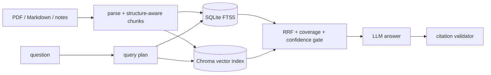

# AI Study Assistant

Local-first document QA for study notes. The project is an inspectable RAG system: it retrieves evidence, refuses weak context, and checks citations before returning an answer.

## Problem

“Chat with a PDF” demos often hide retrieval failures and unsupported answers. This project makes the retrieval path, evidence selection, refusal decision, and citation validation observable.

## System


```mermaid
flowchart LR
  A[PDF / Markdown / notes] --> B[parse + structure-aware chunks]
  B --> C[(SQLite FTS5)]
  B --> D[(Chroma vector index)]
  Q[question] --> E[query plan]
  E --> C
  E --> D
  C --> F[RRF + coverage + confidence gate]
  D --> F
  F --> G[LLM answer]
  G --> H[citation validator]
```

## Engineering decisions

- **Hybrid retrieval:** FTS5 preserves exact identifiers and lexical-heavy questions; dense search covers paraphrases. RRF combines ranks because BM25 and cosine scores are not on a shared scale.
- **Confidence gate:** vector-only context below the configured threshold is refused before generation. This trades false refusals for fewer unsupported answers.
- **Evidence boundary:** HyDE text may create a retrieval query, but only retrieved source chunks can support or be cited in an answer.
- **Coverage constraint:** comparison questions reserve a candidate from each selected document before filling the remaining slots.
- **Citation validation:** citation markers, sentence coverage and evidence references are checked; this does not establish semantic entailment for every claim.

## Baseline and failures

The original 48-query regression set was a controlled single-textbook fixture: 43 answerable, 5 no-answer, and 3 labeled hard-negative cases. Its committed summary reports vector Hit@1 **0.9302** and hybrid Hit@1 **1.000**; an older table said 0.953, so the table is treated as stale and the JSON is the source of record. The original corpus is intentionally small and is not a general RAG benchmark.

The code path also showed why a component ablation was needed: the previous vector and hybrid modes both applied ranking penalties and query-coverage heuristics. Their scores could not be attributed to vector search, FTS5, or RRF alone.

## Controlled ablation (2026-09-16)

`backend/eval/retrieval_challenge_v1.jsonl` retains the 48 legacy cases and adds paraphrases, Chinese/English cross-language queries, abbreviations, numeric questions, near-duplicate distractors, multi-hop evidence, lexical/semantic-heavy cases, and unsupported questions. It contains **111 queries / 93 answerable / 18 no-answer / 21 documents / 25 chunks / 29 hard-negative queries**; query languages are **69 Chinese and 42 English**. The added labels are AI-authored synthetic regression fixtures, not independent human annotation.

All variants ran with local `BAAI/bge-small-zh-v1.5`, CPU, one torch thread, three repeats, warm retrieval, and the committed corpus hash. P50/P95 include query embedding and reranking, but exclude indexing, generation, translation, and startup.

| Variant | MRR | Hit@1 | No-answer accuracy | Hard-negative accuracy | P50 / P95 |
|---|---:|---:|---:|---:|---:|
| Vector only | 0.728 | 0.613 | 0.000 | 0.517 | 4.3 / 5.0 ms |
| FTS5 only | 0.771 | 0.688 | 0.333 | 0.345 | 0.6 / 0.8 ms |
| Vector + FTS5 (interleave) | 0.760 | 0.613 | 0.000 | 0.517 | 5.2 / 5.8 ms |
| Vector + FTS5 (RRF) | 0.834 | 0.763 | 0.000 | 0.586 | 5.2 / 5.7 ms |
| + query coverage | 0.853 | 0.785 | 0.000 | 0.586 | 5.2 / 5.8 ms |
| + confidence gate | 0.853 | 0.785 | 0.278 | 0.586 | 5.2 / 5.8 ms |
| + local reranker | 0.878 | 0.817 | 0.333 | 0.655 | 334.3 / 417.1 ms |
| Current path, including penalties | 0.885 | 0.849 | 0.278 | 0.690 | 5.6 / 6.4 ms |

These numbers are a controlled regression result. The gate rejects only **5/18 unsupported queries**; it falsely refuses **0/93 answerable queries** on this fixture. FTS-only refuses 9/93 answerable queries. The reranker improves ranking but exceeds the earlier 100 ms retrieval gate. The lexical path includes the existing exact-match fallback for short acronyms. Full Hit@3/Recall@5, definitions, failures and trade-offs are in the [experiment record](docs/experiments/retrieval-ablation.md); [raw output](docs/experiments/retrieval-ablation-results.json) includes per-query results and provenance.

## Limitations

- The challenge corpus is synthetic and compact; it does not represent a production workload.
- Translation, query decomposition, generation faithfulness, and user-document distributions are not measured by the retrieval table.
- The local reranker result depends on CPU model loading and is not a deployment benchmark.
- No model was fine-tuned in this repository.

## Reproduce

```bash
cd backend
python3.12 -m venv .venv
source .venv/bin/activate
python -m pip install -r requirements.txt -r requirements-dev.txt -r requirements-local.txt
ASA_EMBEDDING_PROVIDER=local \
ASA_EMBEDDING_MODEL=BAAI/bge-small-zh-v1.5 \
ASA_EMBEDDING_DIMENSION=512 \
ANONYMIZED_TELEMETRY=False \
python -m app.evaluation.ablation \
  --output ../docs/experiments/retrieval-ablation-results.json
python -m pytest tests -q
```

The first run may need the model cached or a Hugging Face connection. Outputs are versioned only after checking the dataset and corpus hashes. The original evaluation commands remain in [`docs/EVALUATION.md`](docs/EVALUATION.md).

To start the application, copy `backend/.env.example` to `.env`, configure an embedding/chat provider, and run `python -m uvicorn app.main:app --host 127.0.0.1 --port 8000`. In another terminal run `cd frontend && npm ci && npm run dev` from the repository root. Local user data lives under `~/.ai-study-assistant/`; the `--corpus` evaluation creates isolated temporary stores.

## AI-assisted development

See [`docs/AI_ASSISTED_DEVELOPMENT.md`](docs/AI_ASSISTED_DEVELOPMENT.md) for the boundary between implementation assistance and developer ownership. Earlier attribution and commits are preserved; this revision does not rewrite history. The former public interview playbook was removed from the current tree because it was preparation material rather than product evidence.

## Evidence index

- [`docs/decisions/`](docs/decisions/) — retrospective rationale for retrieval, evidence, and evaluation choices.
- [`docs/failures/`](docs/failures/) — observed benchmark and measurement failures.
- [`docs/experiments/`](docs/experiments/) — raw ablation output and reproducibility notes.

## License

MIT
